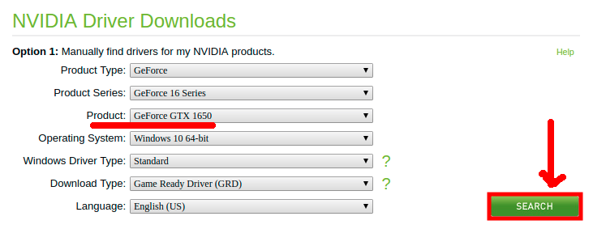
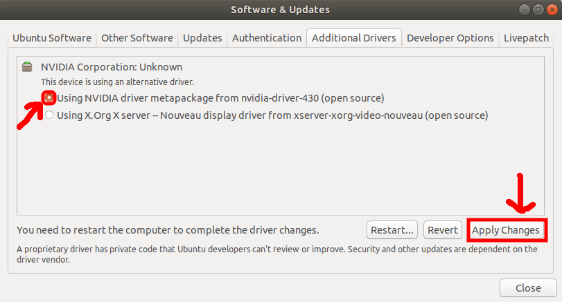

#Installing NVIDIA Video Graphics Driver

####Pre-requisites
- Identify what graphics card product you have.
- Make sure to have both monitors connected on the video ports of the graphics card.

####Steps
>1. Go to this website https://www.nvidia.com/Download/index.aspx?lang=en-us and fill-up the form like shown below but based on your video graphics product and click **Search**.

>2. You will see the version number of the driver in the next screen and take note of that one. In my case it is **430.86**.
>3. Open terminal via application menu or you can use the shortcut  **Ctrl+Alt+T**.
>4. When it opens, run the command: 
>```sudo add-apt-repository ppa:graphics-drivers/ppa```
>5. Then: ```sudo apt update```
>6. After that, Launch **Software & Updates** utility and navigate to **Addtional Drivers** tab. Click on the version based on Step 2, then click **Apply Changes**.

>7. In addition, if the driver does not install after clicking **Apply Changes**, try running command in terminal:
>```sudo apt install nvidia-driver-430 nvidia-settings```
>8. Once successfully installed, restart your PC. Finally, verify it if you can now use dual monitor setup and if you can now search for NVIDIA Settings in your application menu.

####Next Step
> [Setting up Hibernate on Ubuntu](hibernateButton.md)

####References
> http://ubuntuhandbook.org/index.php/2019/04/nvidia-430-09-gtx-1650-support/

####Version
> Note: To monitor the update of this document, editors must log the date and its update short description. Thanks!
- v0.1 - 06/26/19 - Rumel Amora Docdoc - Initial steps for Installing the NVIDIA Video Graphics Card